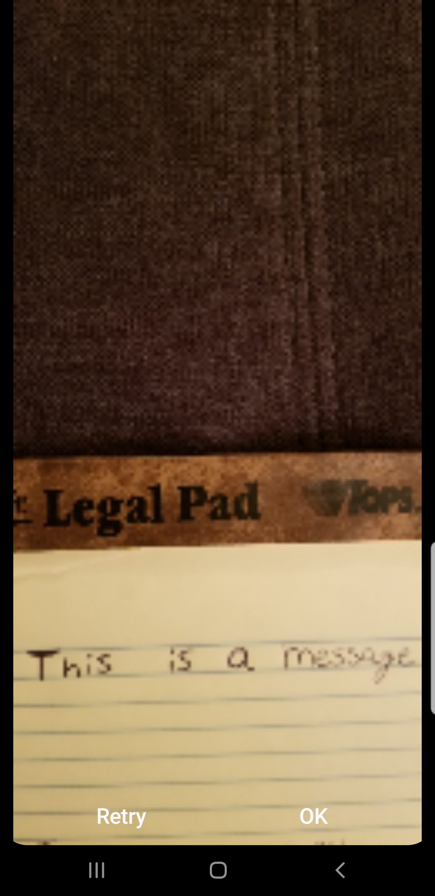
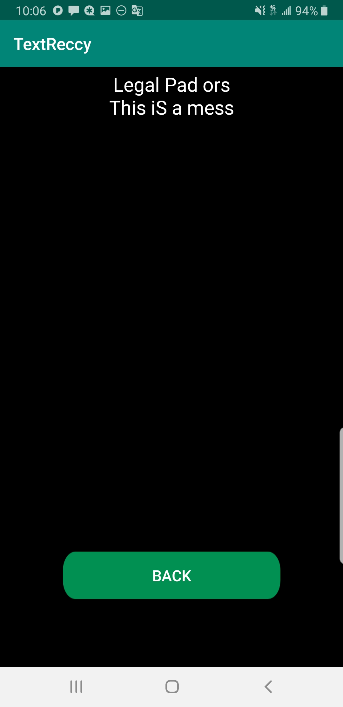

# TextReccy
This is an app used to read text from a captured image.

### Screenshots
<table>
 <tr>
  <th>Original Image</th>
  <th>Translated Image</th>
 </tr>
 <tr>
  <td></td>
  <td></td>
 </tr>
 <tr>
  <td></td>
  <td></td>
 </tr>
</table>

### Notes
 - Implemented using Firebase ML Model
 
##### Other References
 - https://firebase.google.com/docs/ml-kit/recognize-text
